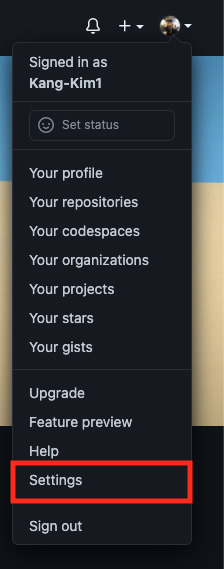
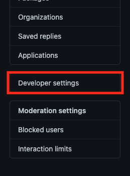
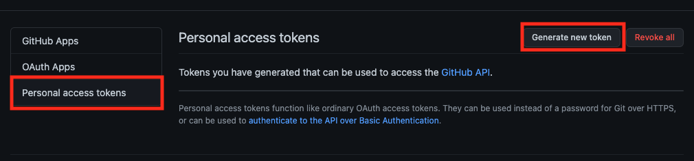
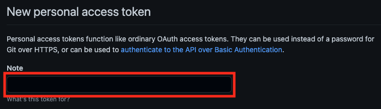
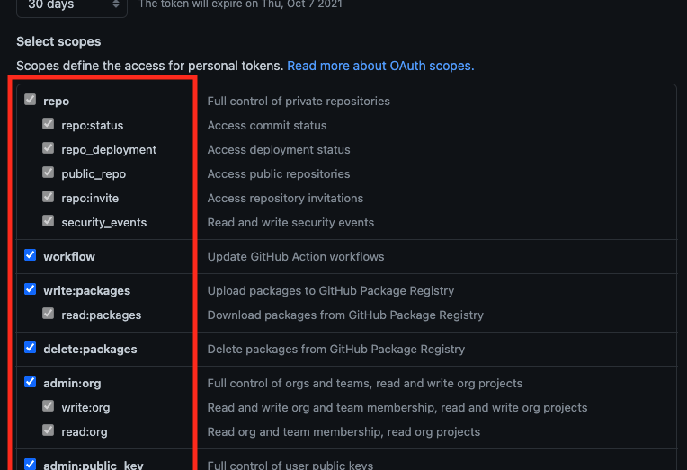
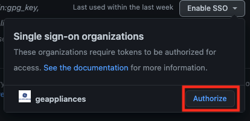
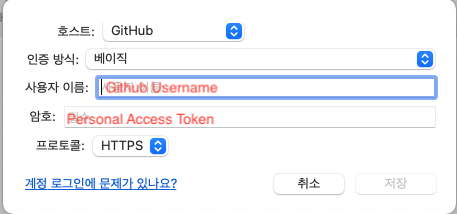
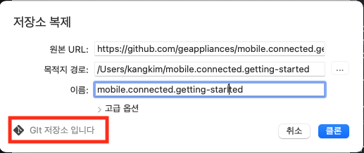

# Set up SourceTree

1. Create [Github](https://github.com/) account

2. Ask Git manager for the access to GE Appliances repository

3. Generate Personal Access Token
    1. Click on profile icon on the top right corner in Github 
    2. Select Settings  
        
    3. Select Developer Settings  
        
    4. Select Personal access tokens
    5. Click on Generate new token button  
        
    6. Enter Note for the name of token, and select all scopes for the full access  
        
        
    7. Click on Generate token button and keep generated token safe for later
    8. Authorize the generated token to enable SSO  
         

4. Download and install [SourceTree](https://www.sourcetreeapp.com/)

5. Set up Github account for SourceTree
    1. Select File > Settings
    2. Select Account tab
    3. Click Add button and set specifics as below  
         
    4. Clone private repository to confirm the connection  
         
